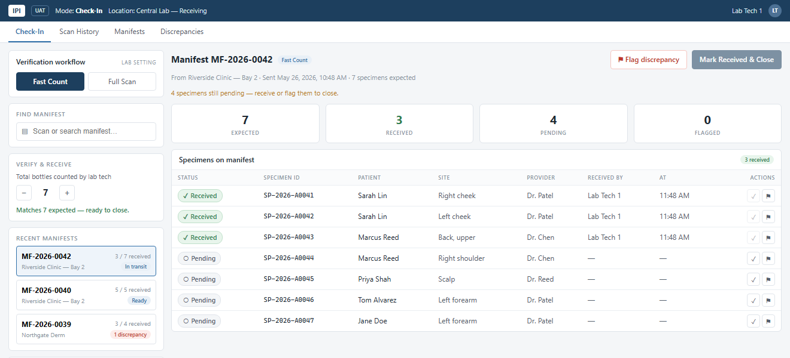

# Specimen Check-In

A vertical slice of the IPI Pro specimen receiving workflow: a technician opens a manifest,
checks in each bottle against what the clinic said it shipped, flags what is missing, and
closes the manifest once it reconciles.

Built for the Seven Seas Strategies / NetSoft Full Stack Developer technical assignment.

> **Synthetic data only.** Every lab, patient and specimen in this repository is invented.



## Stack & choices

| Area | Choice | Why |
| --- | --- | --- |
| Backend | ASP.NET Core 8, EF Core 8, code-first | Required by the brief; .NET 8 is the current LTS. |
| Database | **SQL Server** — LocalDB on Windows, Docker elsewhere | Preferred by the brief, and its **row-level security** gives tenant isolation a backstop inside the database. SQLite would have shipped faster but would have left the isolation living entirely in application code. |
| Front-end | Vue 3 + Vite + TypeScript + Pinia | Required by the brief. |
| Tests | xUnit (34), Vitest + Vue Test Utils (7) | Aimed at the reconciliation rules and the tenant boundary. |

The Command/Query split is kept as separate projects so the write side and the read side
cannot quietly grow into each other:

```
backend/
├─ SpecimenCheckIn.Models/     entities, domain rules, API contracts
├─ SpecimenCheckIn.Context/    DbContext, row-level security, migrations, tenancy
├─ SpecimenCheckIn.Commands/   receive / flag / close        (write side)
├─ SpecimenCheckIn.Queries/    list / get / session          (read side)
├─ SpecimenCheckIn.WebAPI/     controllers, middleware, seeding
└─ SpecimenCheckIn.Tests/      reconciliation, idempotency, isolation, audit
frontend/                       Vue 3 app
```

## Running it locally

Prerequisites: [.NET 8 SDK](https://dotnet.microsoft.com/download) and
[Node.js 20+](https://nodejs.org).

Defaults work as-is on Windows, so configuration is optional: `cp .env.example .env` only if
you want to change the API's port or the lab you act as. `.env.example` documents both.

### 1. Database

**Windows** — nothing to do. SQL Server LocalDB ships with Visual Studio and the default
connection string already points at it.

**macOS / Linux** — start SQL Server and point the API at it:

```bash
docker compose up -d
export ConnectionStrings__SpecimenCheckIn="Server=localhost,1433;Database=SpecimenCheckIn;User Id=sa;Password=Local_Dev_Pa55w0rd!;TrustServerCertificate=True"
```

### 2. Backend

```bash
cd backend
dotnet run --project SpecimenCheckIn.WebAPI
```

Migrations are applied and the database seeded on start, so "clone, run" is the whole setup.
The API listens on <http://localhost:5080>, with Swagger at <http://localhost:5080/swagger>.

Existing data is left alone on restart — a technician's work should survive one, and the
seed only fills an empty database. To get back to the starting state after clicking around:

```bash
dotnet run --project SpecimenCheckIn.WebAPI -- --reset-db
```

That drops the database, rebuilds it from the migrations and reseeds. It is refused outside
Development: a flag that erases everything should not be one typo away from real data.

### 3. Front-end

```bash
cd frontend
npm install
npm run dev
```

The app is served at <http://localhost:5173>.

### Tests

```bash
cd backend && dotnet test     # needs the database; the isolation under test is enforced by it
cd frontend && npm test
```

### Seeing the isolation for yourself

The seed creates two labs: `1` **Central Lab** (three manifests) and `2` **Westside
Pathology Lab** (one). Restart the front-end as the other lab:

```bash
cd frontend && VITE_LAB_ID=2 npm run dev
```

The worklist shows only Westside's manifest, and the header names Westside. Asking for a
Central Lab manifest by id — `curl -H "X-Lab-Id: 2" http://localhost:5080/manifests/{id}` —
answers **404**, not 403: to Westside, the row does not exist.

## API

Every call carries `X-Lab-Id`. `X-Lab-Tech` optionally names the technician (default
`Lab Tech 1`); it labels the work and is not a permission.

| Method + path | Purpose |
| --- | --- |
| `GET /session` | The lab and technician this request acts as |
| `GET /manifests` | This lab's manifests, newest shipment first |
| `GET /manifests/{id}` | Manifest detail with its specimens (404 if not this lab's) |
| `POST /manifests/{id}/specimens/{sid}/receive` | Mark received (idempotent) |
| `POST /manifests/{id}/specimens/{sid}/flag` | Flag missing → raises a discrepancy |
| `POST /manifests/{id}/close` | Close (refused unless reconciled) |

Refusals are `ProblemDetails` carrying a stable `code` — `manifest_not_reconciled`,
`manifest_already_closed`, `manifest_closed`, `manifest_changed_concurrently`, `not_found` —
so a client can branch on the reason without matching on prose.

**Reconciled means nothing is unknown, not that everything arrived.** A pending bottle
blocks the close; a bottle flagged missing does not, and the manifest closes as
`ClosedWithDiscrepancy` so the two outcomes stay distinguishable afterwards.

## Write-up

### 1. Azure topology

```
Browser ──TLS──► Static Web Apps (Vue bundle, CDN)
   │
   └────TLS──► App Service (Linux, ASP.NET Core)
                  │  managed identity, no connection secret
                  └──Private Endpoint──► Azure SQL (TDE, RLS)
```

The Vue build is static, so it belongs on **Static Web Apps**, not on a server that has to be
patched. The API runs on **App Service** — the workload is a small stateless HTTP app, and
App Service's scale-out and slots cover it without anyone learning Kubernetes for it.

The database is **Azure SQL**, reached over a **Private Endpoint** so its traffic never
touches the public internet, with **Managed Identity** instead of a password. This is worth
the setup cost twice over: no connection string to leak, and the isolation story stays
about the code rather than about who has the secret. Config and any remaining secrets go in
**Key Vault**; telemetry to **Application Insights**.

Two things the slice does not need, and why they would appear if it grew: **Blob Storage**
with a private endpoint once requisition scans are attached to a manifest, because PDFs do
not belong in a row; and **Service Bus + a Function** once a discrepancy has to notify the
originating clinic, because the technician should not wait on someone else's mail server to
finish a check-in.

One detail worth flagging: the tenant scoping relies on `SESSION_CONTEXT`, which is set per
connection. Azure SQL supports it and connection pooling resets it between uses, so the
model holds when App Service scales out — every request sets the session context on the
connection it borrows.

### 2. Tenant isolation

Three layers, arranged so that the outer two are convenience and the innermost is the guarantee.

**The lab is resolved once, from the request, and never from a query.** `TenantMiddleware`
reads it before any handler runs, refuses a request that names no lab (400) or a lab that
does not exist (403), and binds it write-once so nothing downstream can reassign it. Neither
the queries nor the commands accept a lab parameter — *there is no way to express the
question* "another tenant's data", which is stronger than filtering it correctly.

**A global query filter** scopes every read. It is applied by walking the model, not entity
by entity, so a tenant-owned table added later cannot be left unfiltered by forgetting a line.

**Row-level security is the actual guarantee.** A security policy applies a filter predicate
(other labs' rows are invisible to reads, updates and deletes) and a block predicate (a write
that would cross the boundary errors out rather than being silently dropped), both keyed on
`SESSION_CONTEXT`. `LabId` is not settable from application code at all: the column defaults
to `fn_CurrentLabId()`, so the database stamps it on insert.

The important property is that it **fails closed**. With no lab in session context the
function returns `NULL`, the `NOT NULL` column rejects the write, and the query filter throws
rather than falling back to "no filter" — the failure mode that would return everyone's rows.

**Testing that it holds as the codebase grows** is the part that cannot be left to review
diligence, because the mistake is always an omission — a new table, a query someone wrote by
hand at 6pm. So:

- `TenantCoverageTests` reads the EF model and fails if any `TenantOwnedEntity` is missing a
  query filter or missing from the security policy's table list. A new tenant table that
  nobody protected turns a test red rather than turning up in an incident.
- The isolation tests run against **real SQL Server, not an in-memory provider** — a fake
  database would test the layer that is not the safety net and quietly skip the one that is.
- The test that matters most opts out of the query filter with `IgnoreQueryFilters()` and
  still sees only its own lab. It is asserted in both directions — that the lab's own row
  survives the query — because "sees nothing else" passes trivially against an empty result.

Growing the codebase, I would add one more: a suite that drives every endpoint as lab B
against lab A's ids and asserts 404 across the board, generated from the route table so new
endpoints are covered by default rather than by remembering.

### 3. HIPAA-aware handling

**In transit.** TLS everywhere and HSTS at the edge; `Encrypt=true` to the database, over a
private endpoint so it is not merely encrypted but not routable from outside the VNet. CORS
is an allowlist of one origin, not `*`.

**At rest.** TDE is on by default for Azure SQL and covers backups. For patient columns I
would evaluate **Always Encrypted**, honestly weighing it: it would keep names opaque even
to a DBA, and it would cost the ability to search or sort on them — a real trade to make
deliberately rather than by default. Keys in Key Vault with rotation; backups inherit the
encryption and need the same retention policy as the data.

**In logs.** This is where PHI leaks in practice, because nobody decides to log it — it
arrives as a side effect. So: the exception handler logs the **reason code only**, never the
message, which names manifest codes. The audit log carries **ids, actor and timestamp — no
patient details**, since the ids reconstruct the picture from the tenant's own data anyway.
Request bodies are never logged. In production I would add a redacting telemetry processor
and pin retention explicitly rather than inheriting a default nobody chose.

**Accountability.** Every action that changes something appends to an audit log that is
**append-only in the database, not just in the application** — a trigger rolls back `UPDATE`
and `DELETE`. A log that any connection holding a script can rewrite is not evidence of
anything. It is tenant-owned like everything else: who handled a lab's specimens is that
lab's business.

## With more time I would…

**The gap I would close first.** `RowVersion` on the manifest catches two technicians closing
at once. It does **not** catch someone receiving a bottle while another closes, because that
touches `Specimen`, not `Manifest`. Bumping the manifest on every scan would close it — and
would make two technicians scanning *different* bottles collide, which is worse than the race
it fixes. The real answer is to make close conditional on the specimen states it read, which
is a few lines and a test I did not want to rush.

Then, roughly in order:

- **Real auth.** The lab would come from a verified token claim. Only the line that reads it
  changes: everything below already treats the tenant as server-side state.
- **Off-manifest bottles** — the third stretch goal, and the half of the discrepancy story
  that is missing. The model already has `DiscrepancyType.OffManifest` for it.
- **Resolving discrepancies.** They can be raised but never closed out, so
  `DiscrepancyStatus.Resolved` is currently unreachable.
- **Pagination.** The worklist loads every manifest a lab has ever received. Fine for three,
  not for three thousand.
- **The endpoint-level isolation sweep** described above, and an end-to-end happy path.
- **CI** running both suites, with the database in a container.

**On the two stretch goals.** The brief said to pick at most one; I did the audit log and the
component test. The audit log earned its place because it is the same argument as the tenant
isolation — the database enforces the claim, not the application — and it is what makes the
HIPAA answer above a description of the code rather than a plan. If only one had been allowed
to stay, it would be that one.
